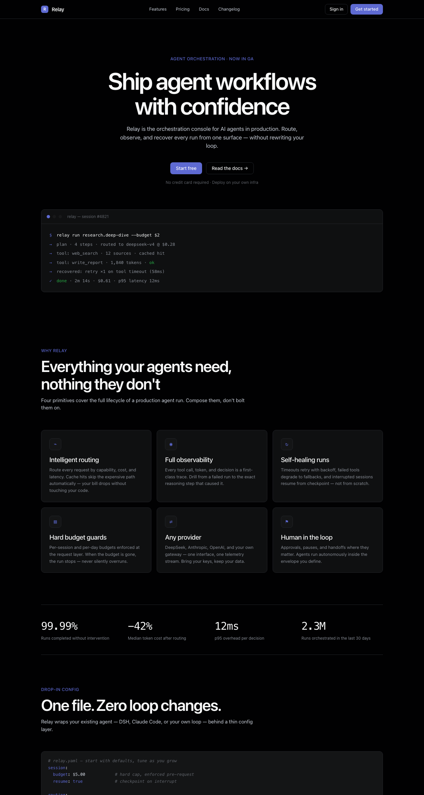
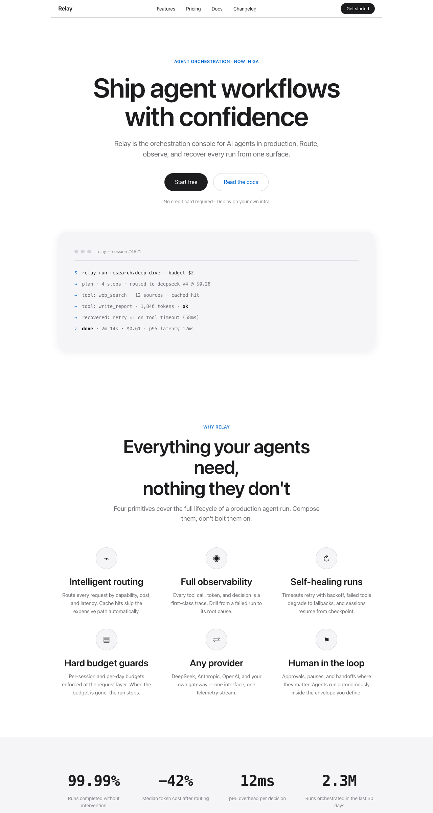
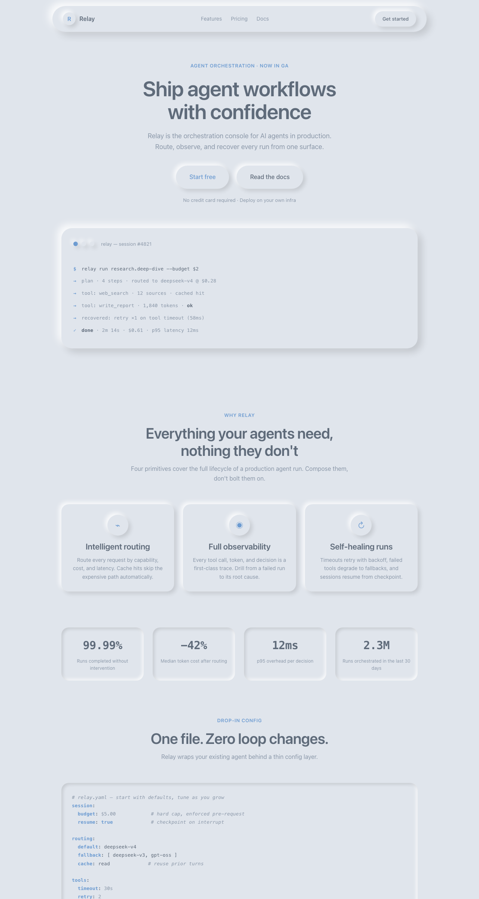
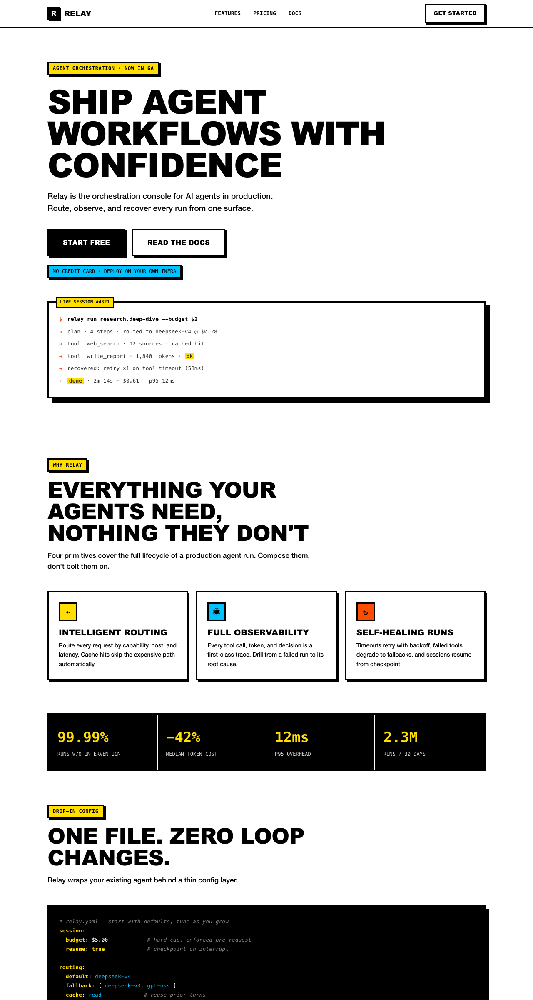
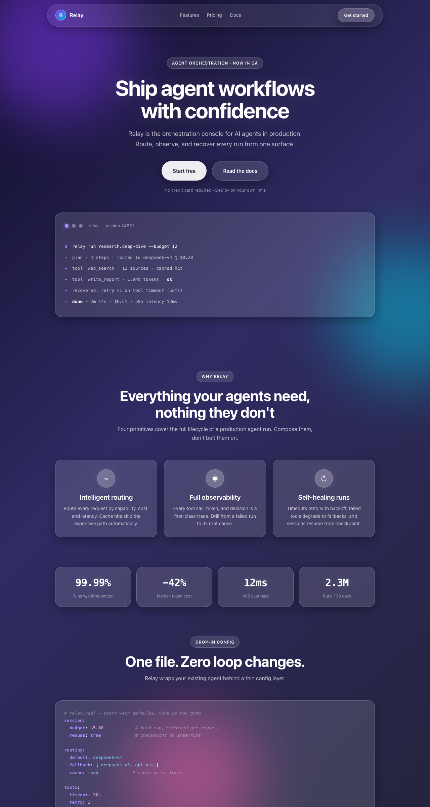
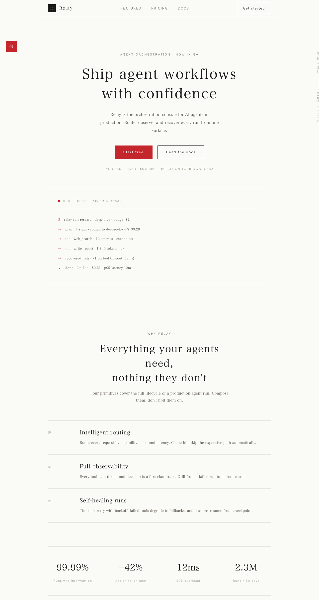

# dsh-design-skills

**Design aesthetics skill pack for [DeepSeek Harness](https://github.com/deepseek-ai/deepseek-harness) (DSH) — keeps your vibe-coded websites away from the "AI look".**

DeepSeek Harness 设计美学技能包 —— 让 vibe coding 出来的网站摆脱「AI 味」。

> 模型不缺"怎么建站"，缺"怎么建得好看"。本技能包把经过验证的设计风格提炼成
> 可执行的规范（token + 组件规则 + 禁用清单 + 验收清单），模型匹配后自动遵循。
>
> Models don't lack "how to build a site" — they lack "how to make it look good".
> This pack distills proven design aesthetics into executable specs (tokens +
> component rules + forbidden lists + acceptance checklists).

[](LICENSE)
[](https://github.com/deepseek-ai/deepseek-harness)
[](https://awesome-dsh-plugin.com)

English | [中文](README.zh.md)

## Preview / 效果预览

Same product (a fictional agent-orchestration console, "Relay"), six aesthetics —
the exact "before / after" of what these skills do to your vibe-coded site:

同一产品（虚构的 Agent 编排平台 "Relay"）的六种风格效果——这就是本技能包
对 vibe coding 产物的实际影响：

| `dark-saas` (dark, Linear-inspired) | `apple-minimal` (minimal white) | `neo-neumorphism` (soft UI) |
|---|---|---|
|  |  |  |

| `brutalism` (hard-edge) | `glassmorphism` (frosted glass) | `japanese-minimal` (zen serif) |
|---|---|---|
|  |  |  |

Demo source: [`examples/dark-saas-landing.html`](examples/dark-saas-landing.html) · [`examples/apple-minimal-landing.html`](examples/apple-minimal-landing.html) · [`examples/neo-neumorphism-landing.html`](examples/neo-neumorphism-landing.html) · [`examples/brutalism-landing.html`](examples/brutalism-landing.html) · [`examples/glassmorphism-landing.html`](examples/glassmorphism-landing.html) · [`examples/japanese-minimal-landing.html`](examples/japanese-minimal-landing.html)

## What's inside / 包含的技能

| Skill | 风格 / Style | 适用场景 / Use for |
|---|---|---|
| [`dark-saas`](skills/dark-saas/SKILL.md) | 深色 SaaS（Linear 式）<br/>Dark SaaS, Linear-inspired | 开发者工具、数据看板、AI 产品、SaaS 后台<br/>Dev tools, dashboards, AI products |
| [`apple-minimal`](skills/apple-minimal/SKILL.md) | 极简白（Apple 式）<br/>Minimal white, Apple-style | 产品官网、落地页、作品集<br/>Product sites, landing pages, portfolios |
| [`neo-neumorphism`](skills/neo-neumorphism/SKILL.md) | 新拟态 / Soft UI<br/>Neumorphism | 个人主页、健康/理财 App、演示 Demo<br/>Personal pages, lifestyle apps, demos |
| [`brutalism`](skills/brutalism/SKILL.md) | 粗野主义 / Brutalism<br/>Hard-edge, neo-brutalist | 实验性产品、艺术/独立项目、开发者工具<br/>Experimental products, indie sites, dev tools |
| [`glassmorphism`](skills/glassmorphism/SKILL.md) | 毛玻璃 / Glassmorphism<br/>Frosted glass | AI 产品、SaaS 官网、Dashboard、演示 Demo<br/>AI products, SaaS sites, dashboards, demos |
| [`japanese-minimal`](skills/japanese-minimal/SKILL.md) | 日式极简 / Japanese Minimal<br/>Zen serif, wabi-sabi | 文化/美学类产品、博客、艺术展、和风品牌<br/>Cultural/aesthetic products, blogs, art sites |

## Install / 安装

```bash
dsh plugin --profile web add dsh-design-skills
```

Or add the repo as a local profile dependency / 或本地安装：把仓库放进
`$DSH_HOME/profiles/node_modules/`（符号链接），然后在 profile 的
`cordis.patch.yml` 中插入 `dsh-design-skills`。

## Usage / 使用

在会话中直接说：

- 「用深色 SaaS 风给我做一个 AI 产品落地页」→ 自动匹配 `dark-saas`
- 「帮我做一个 Linear 风格的数据看板」→ 自动匹配 `dark-saas`
- 「做一个苹果官网那种极简的落地页」→ 自动匹配 `apple-minimal`
- 「Soft UI 风格的个人主页」→ 自动匹配 `neo-neumorphism`

技能通过渐进式披露工作：会话开始时模型只看到技能名与描述，
当任务匹配时才加载完整 SKILL.md（token、组件规则、禁用清单）。

## How it works / 原理

- 每个技能是标准的 `skills/<name>/SKILL.md`（YAML frontmatter：`name` + `description` 必填）。
- `index.js` 以 `ctx.skills` provider 形式注册本包全部技能（rank 600，与官方内置同级）。
- 声明 `dsh.bundle` manifest，可通过 `dsh plugin add` 一键安装。

## Roadmap / 路线图

- [x] Six styles: dark SaaS, minimal white, neumorphism, brutalism, glassmorphism, Japanese minimal
- [x] Full landing-page demo + promo screenshot for every style
- [ ] Scenario workflows: landing page / portfolio / docs site / SaaS admin
- [ ] Tokens in Tailwind & CSS-variable dual formats

## Compliance / 合规说明

本仓库的设计规范参考了 MIT 许可的开源项目（[awesome-design-md](https://github.com/VoltAgent/awesome-design-md)、[shadcn/ui](https://github.com/shadcn-ui/ui)）。
所有来源、许可证全文与商标声明见 [THIRD_PARTY_NOTICES.md](THIRD_PARTY_NOTICES.md)。
本仓库与所列品牌无任何隶属或背书关系。

## License

[MIT](LICENSE)
